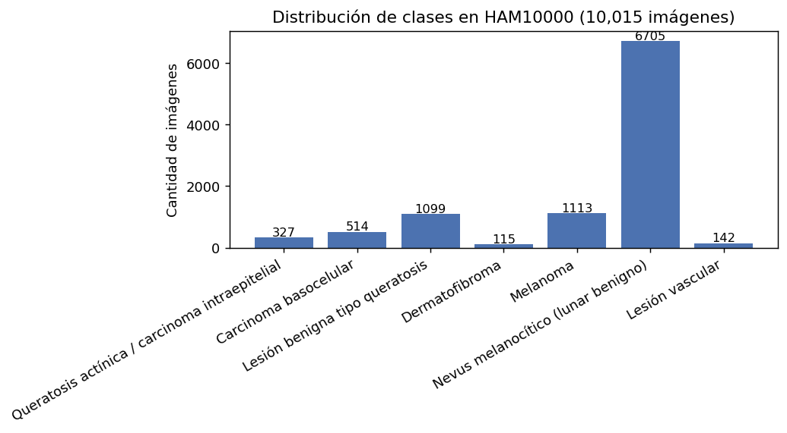
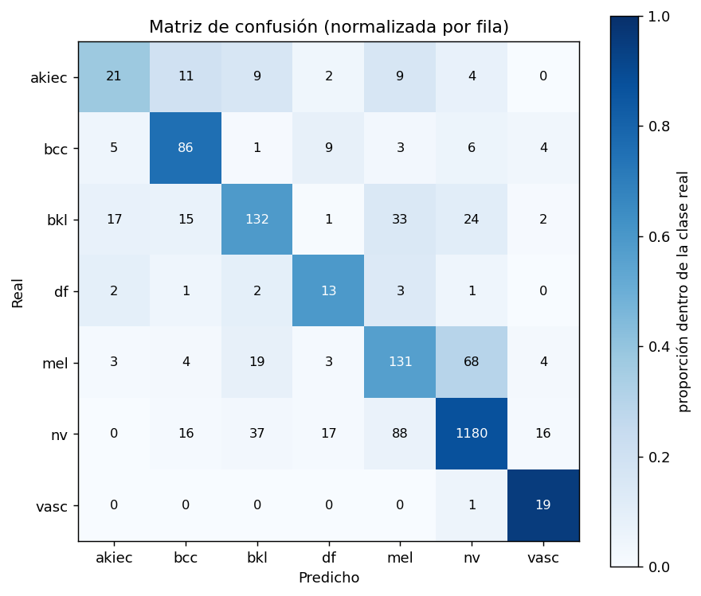
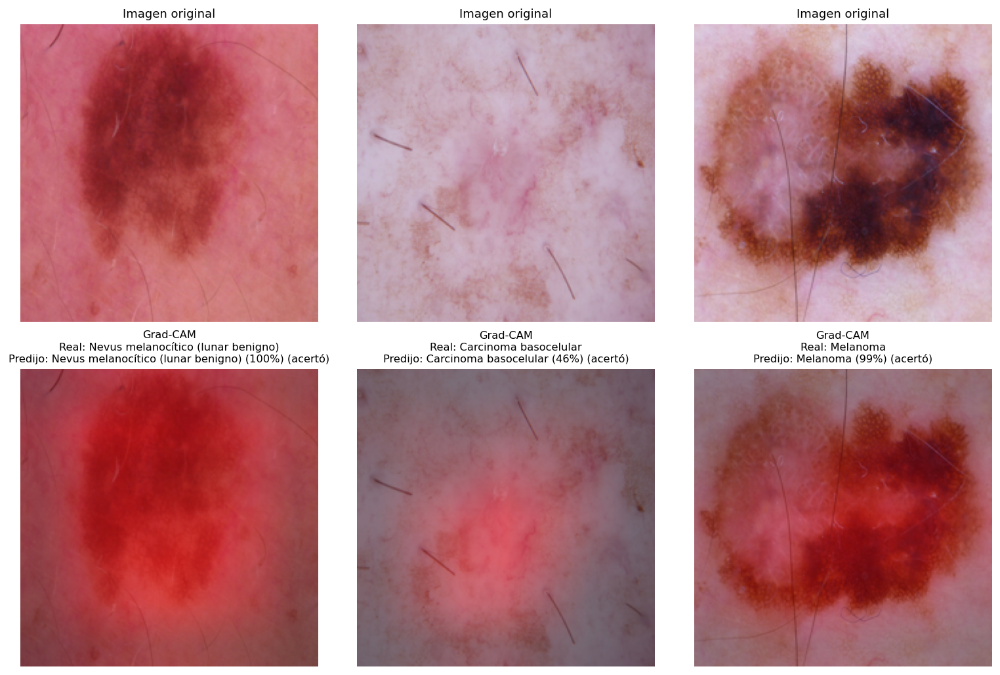
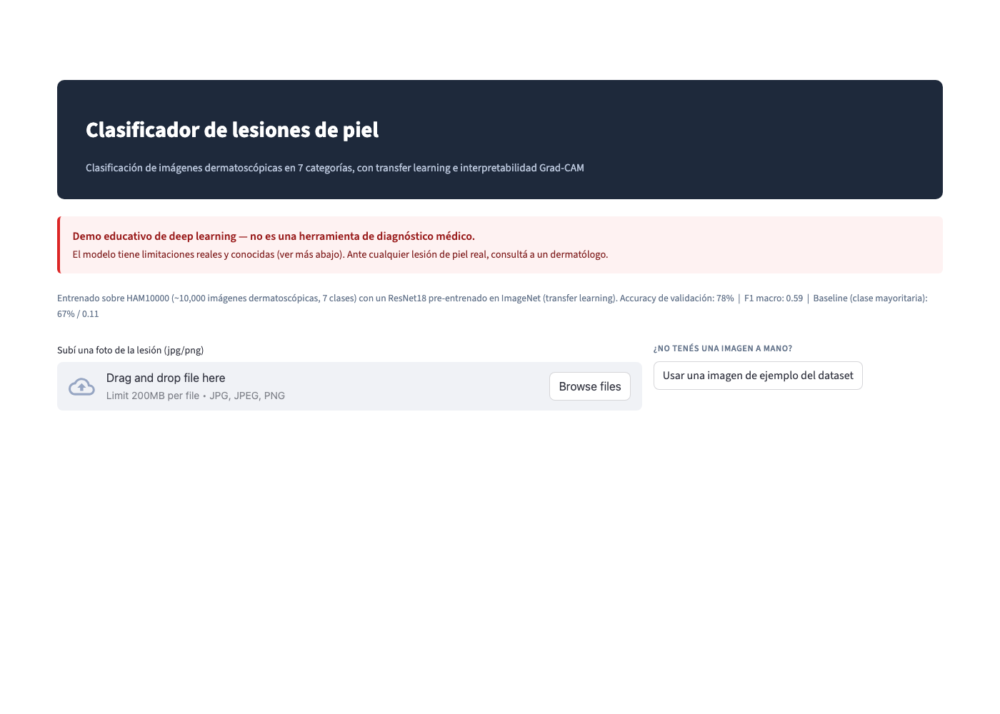
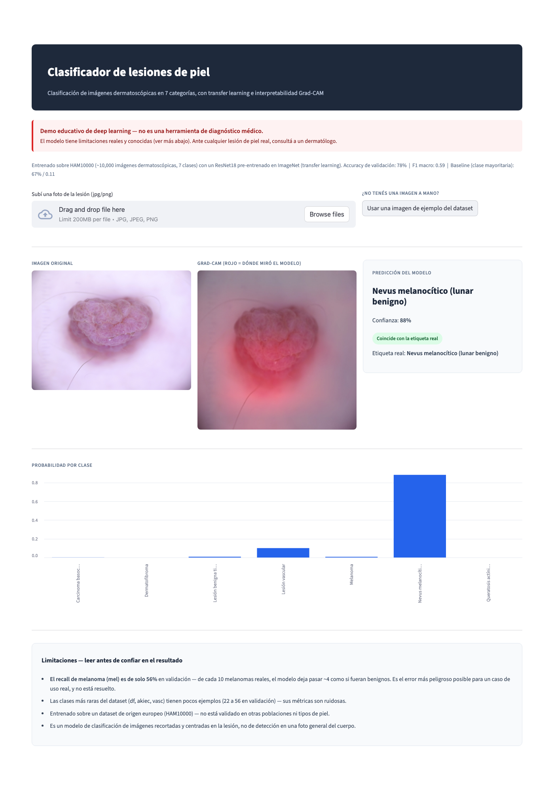

# Clasificador de lesiones de piel (HAM10000)

Clasificación de imágenes dermatoscópicas en 7 tipos de lesión de piel, usando transfer learning sobre un CNN pre-entrenado en ImageNet.

**Demo educativo, no una herramienta de diagnóstico médico.** Ver limitaciones en la sección de Resultados.

## Introducción

El cáncer de piel (particularmente el melanoma) es una de las pocas neoplasias donde la detección temprana cambia radicalmente el pronóstico, y donde el diagnóstico depende en gran parte de la inspección visual de la lesión por parte de un especialista. Esto lo convierte en un caso de uso natural para *computer vision*: la señal diagnóstica está codificada en patrones visuales (textura, asimetría, bordes, color) que son difíciles de reducir a un conjunto pequeño de features tabulares diseñadas a mano.

Las imágenes son un caso particular dentro de los problemas de Deep Learning: el input son píxeles crudos, sin estructura tabular, y no existe una forma razonable de extraer manualmente las features relevantes para distinguir 7 tipos de lesión. Un modelo clásico (regresión, árboles) necesitaría que alguien defina a mano qué medir en cada imagen — textura, bordes, color promedio — perdiendo la mayor parte de la señal. Ahí es donde una CNN, y específicamente el transfer learning desde una red pre-entrenada en un dataset masivo como ImageNet, deja de ser una opción y pasa a ser la herramienta correcta para el problema.

**Objetivo de este trabajo**: entrenar un clasificador de imágenes dermatoscópicas sobre el dataset público HAM10000, evaluarlo con métricas robustas al desbalance de clases (no solo accuracy), y construir una demo funcional que muestre tanto la predicción como una explicación visual (Grad-CAM) de en qué se basó el modelo — evitando tratarlo como una caja negra.

## Metodología

### Dataset

[HAM10000](https://www.kaggle.com/datasets/kmader/skin-cancer-mnist-ham10000) — 10,015 imágenes dermatoscópicas, 7 clases:

| Clase | Significado | Cantidad |
|---|---|---|
| `nv` | Nevus melanocítico (lunar benigno) | 6,705 (67%) |
| `mel` | Melanoma | 1,113 |
| `bkl` | Lesión benigna tipo queratosis | 1,099 |
| `bcc` | Carcinoma basocelular | 514 |
| `akiec` | Queratosis actínica / carcinoma intraepitelial | 327 |
| `vasc` | Lesión vascular | 142 |
| `df` | Dermatofibroma | 115 (1.1%) |



Dataset bastante desbalanceado (`nv` es 67% del total) — se maneja con `CrossEntropyLoss` ponderada por clase, no con sobremuestreo, para no introducir duplicados artificiales de las clases raras.

**Preprocesamiento y prevención de fuga de datos**: el dataset tiene 7,470 lesiones únicas (`lesion_id`) pero 10,015 imágenes — algunas lesiones tienen más de una foto. El split train/valid (80/20) se hace **por `lesion_id`**, no por imagen: si una misma lesión apareciera en train y en valid a la vez, el modelo podría memorizar esa lesión particular en vez de aprender a generalizar, e inflaría artificialmente las métricas de validación.

### Arquitectura

`ResNet18` pre-entrenado en ImageNet (`torchvision.models.resnet18(weights="DEFAULT")`), con la última capa (`fc`) reemplazada por una capa lineal a 7 clases y fine-tuneado sobre HAM10000 completo (no se congelan capas intermedias). Data augmentation en train (flips horizontales/verticales, rotación, jitter de color) — las fotos dermatoscópicas no tienen una orientación "correcta", así que estas transformaciones son válidas (a diferencia de, por ejemplo, voltear una imagen de texto, donde cambiaría el significado).

Grad-CAM sobre la última capa convolucional (`layer4`) para interpretabilidad: sin esto, el modelo es una caja negra — con esto, se puede verificar si está mirando la lesión o el fondo/pelo/regla de medición, que es exactamente el tipo de sesgo (*shortcut learning*) que suelen aprender estos datasets cuando ciertas clases coinciden con artefactos de la foto (ej. reglas de medición presentes solo en fotos de lesiones ya marcadas como sospechosas).

### Entrenamiento y justificación de hiperparámetros

| Hiperparámetro | Valor | Justificación |
|---|---|---|
| Optimizador | Adam | Estándar para fine-tuning de CNNs; converge más rápido que SGD sin necesitar tanto ajuste de learning rate schedule. |
| Learning rate | 1e-4 | Se usa un LR bajo porque el modelo parte de pesos pre-entrenados (ImageNet) — un LR alto destruiría las features ya aprendidas antes de adaptarlas al dominio nuevo. |
| Weight decay | 1e-4 | Regularización L2 leve para reducir sobreajuste, dado que el dataset (10k imágenes) es pequeño para el estándar de visión por computadora. |
| Batch size | 32 | Balance entre estabilidad del gradiente y memoria disponible en la GPU/MPS local. |
| Loss | `CrossEntropyLoss` ponderada por clase inversa a su frecuencia | Sin este ajuste, el modelo colapsa a predecir siempre `nv` (67% del dataset) y obtiene accuracy alta sin ser útil — la ponderación fuerza a que los errores en clases raras (`df`, `vasc`, `mel`) pesen más en la loss. |
| Épocas máximas / early stopping | 15 épocas, `patience=4` sobre `valid_loss` | Evita sobreajuste: se detiene el entrenamiento si la pérdida de validación no mejora en 4 épocas consecutivas, y se conserva el mejor checkpoint, no el último. |
| Split train/valid | 80/20 por `lesion_id`, semilla fija (42) | Reproducibilidad y prevención de fuga de datos (ver Metodología → Dataset). |

## Resultados

| Modelo | Accuracy | F1 macro |
|---|---|---|
| Baseline: siempre predice `nv` (clase mayoritaria) | 67% | 0.11 |
| **ResNet18 + transfer learning** | **78%** | **0.59** |

El F1 macro (que pesa todas las clases por igual, no por tamaño) es la métrica que más importa acá: un accuracy de 67% con F1 de 0.11 significa que el baseline "acierta" solo porque `nv` domina el dataset, pero es inútil para las otras 6 clases. El salto a 0.59 de F1 macro es la evidencia real de que el modelo aprendió a distinguir las clases minoritarias, no solo la mayoritaria.

Por clase (validación, split por `lesion_id`):

| Clase | Precision | Recall | F1 | Soporte |
|---|---|---|---|---|
| nv | 0.92 | 0.87 | 0.89 | 1354 |
| bcc | 0.65 | 0.75 | 0.70 | 114 |
| bkl | 0.66 | 0.59 | 0.62 | 224 |
| mel | 0.49 | 0.56 | 0.53 | 232 |
| vasc | 0.42 | 0.95 | 0.58 | 20 |
| akiec | 0.44 | 0.38 | 0.40 | 56 |
| df | 0.29 | 0.59 | 0.39 | 22 |



La fila de `mel` (melanoma) es la que más importa mirar: 131 aciertos, pero 68 clasificados como `nv` — visualmente confirma la limitación de recall que se discute más abajo.

### Interpretabilidad (Grad-CAM)



Fila de arriba: imagen original. Fila de abajo: mismo caso con el mapa de calor Grad-CAM superpuesto (rojo = donde el modelo se fijó más para decidir). En los tres casos el modelo se concentra en la lesión en sí, no en pelos ni en el fondo de piel — es la validación visual de que no está haciendo trampa con atajos espurios del dataset. El tercer caso (melanoma detectado con 99% de confianza) muestra que el modelo sí puede acertar melanomas con seguridad — el problema documentado abajo es específicamente el ~44% que **no** detecta, no que sea incapaz de detectarlos.

### La aplicación

La demo (Streamlit) permite subir una foto o usar una imagen de ejemplo del dataset, y muestra la predicción junto con el Grad-CAM y la probabilidad por clase — ver capturas y comandos en el Anexo.





### Limitaciones (leer antes de tomar el resultado en serio)

- **El recall de melanoma es 56%.** De 232 melanomas reales en el set de validación, el modelo clasificó 68 como `nv` (benigno) — el peor error posible para un caso de uso médico real: cáncer marcado como benigno. Esto **no está resuelto** y es la limitación más seria del proyecto.
- Las clases más raras (`df`: 22 casos en validación, `akiec`: 56, `vasc`: 20) tienen métricas ruidosas por el tamaño de muestra chico.
- HAM10000 es un dataset de origen mayormente europeo — no está validado en otros tipos de piel ni poblaciones.
- El modelo clasifica imágenes ya recortadas y centradas en la lesión (como las del dataset) — no hace detección sobre una foto general del cuerpo.
- No se hizo calibración de probabilidades — "60% de confianza" no está verificado que signifique "acierta 6 de cada 10 veces" en la práctica.

## Conclusiones y recomendaciones

**Conclusión**: para clasificación de imágenes médicas, deep learning no es una opción a evaluar entre otras — es la herramienta estructuralmente correcta. El salto de F1 macro de 0.11 (baseline) a 0.59 (ResNet18 + transfer learning) es grande e inequívoco: el modelo pasó de ser inútil fuera de la clase mayoritaria a distinguir razonablemente bien las 7 categorías. Transfer learning desde ImageNet fue clave: con solo ~10,000 imágenes (un dataset chico para visión por computadora), entrenar una CNN desde cero habría sido mucho menos efectivo que partir de features visuales ya aprendidas sobre millones de imágenes. La interpretabilidad vía Grad-CAM también resultó esencial — no solo para explicar la predicción, sino para verificar que el modelo no estuviera aprendiendo atajos espurios en vez de la lesión real.

Dicho esto, el modelo **no está listo para ningún uso real**: el recall de melanoma (56%) es la limitación que más importa, porque el costo de un falso negativo en este dominio es clasificar un cáncer como lesión benigna.

**Recomendaciones / próximos pasos**:

1. **Mejorar el recall de melanoma específicamente** (prioridad más alta, clínicamente): pesos de clase aún más agresivos para `mel`, o un umbral de decisión por clase en vez de simplemente `argmax` sobre las probabilidades.
2. Probar una arquitectura más grande (EfficientNet, ViT) y comparar contra este baseline de ResNet18, para ver si la ganancia justifica el costo computacional adicional.
3. Calibración de probabilidades (reliability diagram) — sin esto, no se puede confiar en el número de confianza que muestra la app.
4. k-fold cross-validation por `lesion_id` para un resultado más robusto que un solo split 80/20.

## Anexo: cómo reproducir este trabajo

```bash
python3 -m venv env_skin
./env_skin/bin/pip install torch torchvision kaggle scikit-learn matplotlib pillow pandas streamlit
```

### Bajar el dataset

Necesita credenciales de Kaggle en `~/.kaggle/kaggle.json` (Kaggle → Settings → API → Create New Token).

```bash
./env_skin/bin/kaggle datasets download -d kmader/skin-cancer-mnist-ham10000 -p data --unzip
```

(Si el CLI de `kaggle` se cuelga al descargar — nos pasó — bajarlo directo por HTTP con `curl -L -u usuario:key "https://www.kaggle.com/api/v1/datasets/download/kmader/skin-cancer-mnist-ham10000" -o data/ham10000.zip` y descomprimir a mano.)

### Entrenar

```bash
./env_skin/bin/python scripts/train_model.py
```

### Correr la web

```bash
./env_skin/bin/streamlit run app.py
```

Subís una foto (o usás el botón de "imagen de ejemplo" para probar sin tener una propia) y ves la predicción + un mapa de calor Grad-CAM mostrando en qué región de la imagen se basó el modelo.

### Regenerar las imágenes del readme

```bash
./env_skin/bin/python scripts/make_readme_images.py
```

Genera `images/distribucion_clases.png`, `images/predicciones_ejemplo.png` e `images/matriz_confusion.png` a partir del modelo ya entrenado.

## Anexo: versionado y serving con MLflow + Databricks Free Edition

El entrenamiento sigue siendo local (`train_model.py`, sin cambios). Lo que se agrega es un paso posterior: **versionar** ese checkpoint en el Model Registry de Unity Catalog vía MLflow, y **servirlo** desde un endpoint de Databricks Model Serving. La app (`app.py`) ya no carga `model/model.pt` directamente — llama al endpoint, que siempre sirve la última versión promovida (alias `champion`). El Grad-CAM también se calcula del lado del servidor (necesita gradientes internos del modelo, así que viaja empaquetado junto con la predicción — ver `scripts/mlflow_model.py`).

```
train_model.py (local)  →  register_model.py (versiona en MLflow/UC)  →  deploy_endpoint.py (promueve al endpoint)  →  app.py (llama al endpoint)
```

**Importante:** los pasos 1-3 de abajo son manuales, en la consola de Databricks — no tengo forma de crear una cuenta o generar un token por vos. Los nombres exactos de botones/menúes pueden variar levemente respecto a lo descrito acá (Databricks los cambia con cierta frecuencia); si algo no coincide, guiate por el nombre general (p. ej. "Access tokens" dentro de la configuración de usuario) en vez de la ruta exacta de clicks.

### 1. Crear el workspace de Databricks Free Edition

Entrar a [databricks.com](https://www.databricks.com/learn/free-edition) y crear una cuenta gratuita (Free Edition). Confirma el mail y entra al workspace.

### 2. Confirmar el catálogo/schema de Unity Catalog

Free Edition suele venir con un catálogo `main` y un schema `default` ya creados. Confirmarlo en **Catalog** (panel izquierdo) o, si no existen, crearlos desde un notebook/SQL editor:

```sql
CREATE CATALOG IF NOT EXISTS main;
CREATE SCHEMA IF NOT EXISTS main.default;
```

Si usás otro catálogo/schema, ajustá la variable `UC_MODEL_NAME` en el paso 4 (formato `catalogo.schema.nombre_modelo`).

### 3. Generar un Personal Access Token (PAT)

Dentro del workspace: ícono de usuario (arriba a la derecha) → **Settings** → **Developer** → **Access tokens** → **Generate new token**. En "Scope" elegir **Other APIs**, y en "API scope(s)" agregar `mlflow`, `unity-catalog` y `model-serving`. Copiar el token (no se vuelve a mostrar).

También necesitás la URL del workspace (`DATABRICKS_HOST`), el dominio que aparece en la barra del navegador, ej. `https://dbc-xxxxxxxx-yyyy.cloud.databricks.com`.

### 4. Instalar dependencias y configurar variables de entorno

```bash
./env_skin/bin/pip install mlflow databricks-sdk

export DATABRICKS_HOST="https://tu-workspace.cloud.databricks.com"
export DATABRICKS_TOKEN="dapiXXXXXXXXXXXXXXXXXXXXXXXX"
export UC_MODEL_NAME="main.default.skin_lesion_classifier"   # opcional, es el default
export MODEL_ALIAS="champion"                                 # opcional, es el default
export SERVING_ENDPOINT_NAME="skin-lesion-classifier"         # opcional, es el default
```

### 5. Versionar el modelo ya entrenado

```bash
./env_skin/bin/python scripts/register_model.py
```

Recalcula las métricas de validación, loguea el run en MLflow (params, F1/precision/recall por clase, matriz de confusión) y registra una nueva versión del modelo en `UC_MODEL_NAME`, moviendo el alias `champion` a esa versión. Correr esto de nuevo cada vez que se re-entrena el modelo (`train_model.py`) para versionar el nuevo checkpoint.

### 6. Desplegar / promover el endpoint de serving

```bash
./env_skin/bin/python scripts/deploy_endpoint.py
```

Crea el endpoint la primera vez, o lo actualiza para que sirva la versión detrás del alias `champion` (la última registrada). Free Edition corre esto sobre compute serverless CPU (sin GPU) — para un ResNet18 en modo inferencia alcanza sin problema, aunque el primer request después de estar inactivo puede tardar por el *cold start* de `scale_to_zero`.

### 7. Correr la app apuntando al endpoint

```bash
export DATABRICKS_HOST="https://tu-workspace.cloud.databricks.com"
export DATABRICKS_TOKEN="dapiXXXXXXXXXXXXXXXXXXXXXXXX"
export SERVING_ENDPOINT_NAME="skin-lesion-classifier"
./env_skin/bin/streamlit run app.py
```

(Alternativa a las variables de entorno: crear `.streamlit/secrets.toml` con `DATABRICKS_HOST`, `DATABRICKS_TOKEN`, `SERVING_ENDPOINT_NAME` — útil si se despliega en Streamlit Community Cloud.)

### Notas y límites de este anexo

- No tengo acceso a Databricks para probar `register_model.py`/`deploy_endpoint.py` contra un workspace real — están escritos contra la API documentada de MLflow y `databricks-sdk`, pero los entitlements exactos de Free Edition (límites de compute, tamaños de `workload_size` disponibles, cuotas de Model Serving) cambian con el tiempo. Si un script falla, conviene revisar el mensaje de error contra la doc actual de Databricks antes de asumir que el código está mal.
- Promover una versión es un paso de dos comandos (`register_model.py` luego `deploy_endpoint.py`), no automático — así se puede versionar sin desplegar (por ejemplo, para comparar métricas de varios runs antes de decidir cuál servir).
- El endpoint no expone credenciales de Databricks a la app "gratis": `DATABRICKS_TOKEN` sigue siendo un secreto que hay que manejar con cuidado (no commitear, no loguear).

## Anexo: sitio estático (Vercel) como frontend alternativo

`app.py` (Streamlit) necesita un servidor Python — no se puede hostear en GitHub Pages. Para tener una versión pública sin depender de Streamlit Community Cloud, `web/` es una segunda implementación del mismo frontend como sitio estático (HTML/CSS/JS puro, sin build step) pensada para Vercel:

```
web/
├── index.html          # UI (misma info que app.py: upload, Grad-CAM, probabilidades, limitaciones)
├── api/predict.js       # función serverless: recibe la imagen, llama al endpoint de Databricks, devuelve la predicción
└── samples/             # 14 imágenes de ejemplo (2 por clase) + manifest.json, para el botón "usar ejemplo"
```

`api/predict.js` es la pieza que importa: es la única parte que conoce `DATABRICKS_TOKEN` (como variable de entorno del proyecto en Vercel, nunca en el código ni en el navegador). El navegador solo le habla a `api/predict`, nunca directo a Databricks.

### Desplegar

1. En [vercel.com](https://vercel.com/new), importar el repo de GitHub.
2. **Root Directory**: configurarlo en `web` (el proyecto vive en ese subdirectorio, no en la raíz del repo).
3. Framework preset: **Other** (no hay build step, es HTML/JS estático + funciones serverless en `api/`).
4. En **Environment Variables** del proyecto, agregar:
   - `DATABRICKS_HOST`
   - `DATABRICKS_TOKEN`
   - `SERVING_ENDPOINT_NAME` (opcional, default `skin-lesion-classifier`)
5. Deploy.

Cada vez que se promueve una nueva versión del modelo (`register_model.py` + `deploy_endpoint.py`), el sitio no necesita ningún cambio ni redeploy — sigue llamando al mismo endpoint, que ahora sirve la versión nueva.

### Notas

- El Grad-CAM llega del servidor como grid 7x7 (igual que en `app.py`) y se reescala con `<canvas>` en el navegador — no hay ningún cálculo de gradientes en el cliente.
- La imagen se reescala en el navegador (máx. 512px de lado) antes de mandarla, tanto para no pasarse del límite de tamaño de payload de las funciones serverless de Vercel como porque el modelo la termina reescalando a 224×224 igual.
- No pude probar el deploy real en Vercel (no tengo una cuenta ahí) — si el import falla o el Root Directory no se detecta como esperaba, la causa más probable es algún default de Vercel que cambió desde que escribí esto.

## Anexo: almacenamiento del dataset en Databricks (Unity Catalog)

Además de versionar el modelo, el dataset HAM10000 también vive en Databricks (no solo en `data/` local), como para poder entrenar/reproducir todo sin depender de la carpeta local ni de volver a bajarlo de Kaggle:

| Qué | Dónde | Cómo se creó |
|---|---|---|
| Imágenes (10,015 `.jpg`) | Volume `main.default.ham10000_data` (`/Volumes/main/default/ham10000_data/images/data/HAM10000_images_part_1/` y `.../part_2/`) | Subidas como un `.zip` vía Files API y descomprimidas server-side con un notebook/job (evita 10,015 llamadas individuales a la API). |
| Metadata (`HAM10000_metadata.csv`) | Tabla Delta `main.default.ham10000_metadata` | `CREATE TABLE ... AS SELECT * FROM read_files(...)` sobre el CSV, ya subido al mismo Volume. |

Verificación rápida (SQL Editor de Databricks, o vía `statement_execution` del SDK):

```sql
SELECT count(*), count(distinct lesion_id) FROM main.default.ham10000_metadata;
-- 10015, 7470 (mismos números que la sección "Dataset" de este readme)
```

Esto es almacenamiento, no un cambio de pipeline: `train_model.py` y `register_model.py` siguen leyendo de `data/` local por defecto. Adaptarlos para leer directo del Volume/tabla Delta (en vez de la carpeta local) es el paso lógico siguiente si se quiere entrenar desde un notebook de Databricks en vez de localmente, pero no estaba en el alcance de lo pedido acá.
